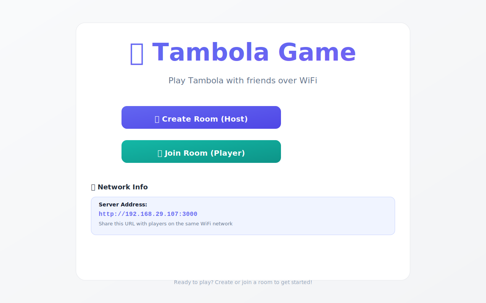
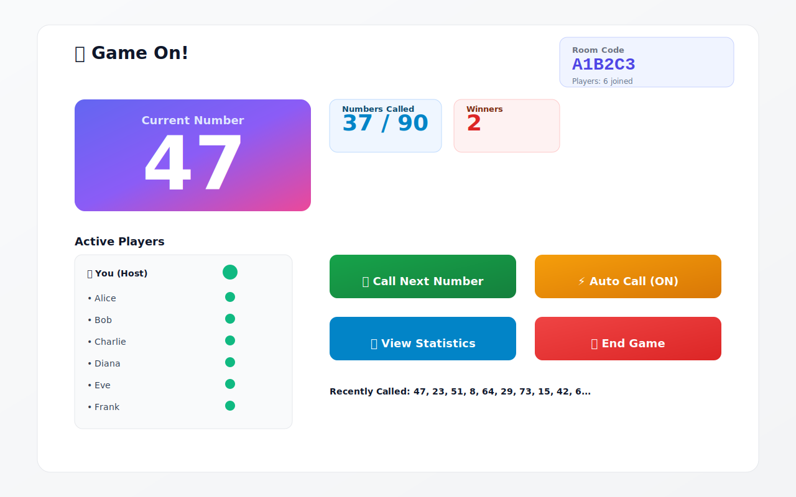
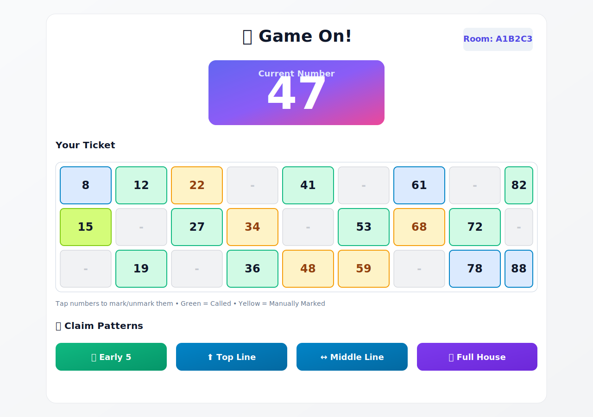
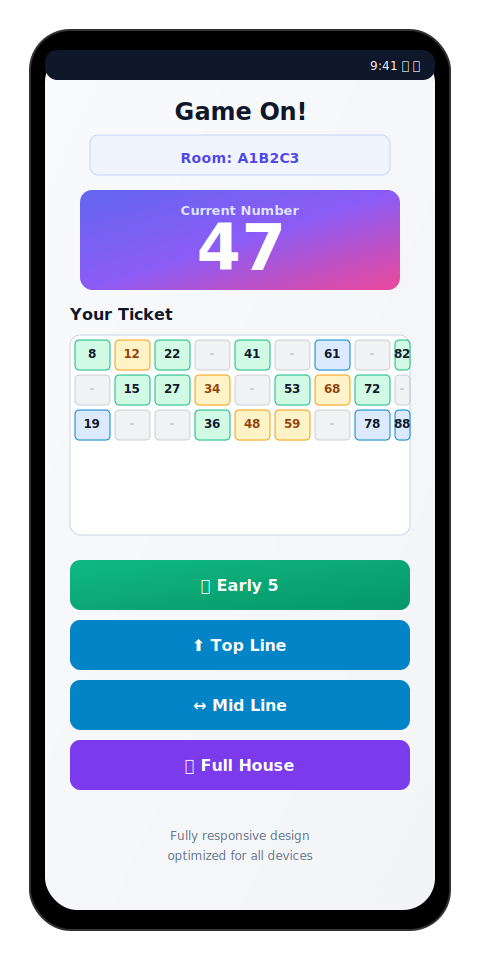

# 🎲 Tambola Game - Multiplayer WiFi Edition

<div align="center">


[](LICENSE)
[](https://nodejs.org/)
[](https://angular.io/)
[](CONTRIBUTING.md)

**A modern, real-time multiplayer Tambola (Housie/Bingo) game for WiFi/LAN networks**

[Features](#-features) • [Quick Start](#-quick-start) • [Documentation](#-documentation) • [Contributing](#-contributing) • [License](#-license)

</div>

---

## 📖 About

Tambola Game is a full-featured, open-source implementation of the classic Indian bingo game (also known as Housie). Built with modern web technologies, it enables seamless multiplayer gaming over local WiFi networks—no internet connection required!

Perfect for family gatherings, parties, corporate events, or any social occasion where you want quick, fun entertainment.

### 🎯 What is Tambola?

Tambola (Housie/Bingo) is a popular game of chance where players mark numbers on tickets as they're called out. Players win by completing specific patterns:
- **Early 5**: First five numbers
- **Top/Middle/Bottom Line**: Complete rows
- **Full House**: All 15 numbers on the ticket

---

## ✨ Features

### 🎮 Game Features
- **Real-time Multiplayer**: Play with up to 20 players simultaneously
- **WiFi/LAN Support**: No internet required—works on local networks
- **Auto-Generated Tickets**: Valid Tambola tickets with proper formatting (3×9 grid, 15 numbers)
- **Auto Number Calling**: Manual or automatic number calling (3-second intervals)
- **Pattern Validation**: Server-side validation prevents cheating
- **Live Updates**: Instant synchronization using WebSocket technology
- **Winner Tracking**: Real-time winner announcements for all patterns

### 🎨 User Experience
- **Modern UI**: Professional design with smooth animations
- **Fully Responsive**: Optimized for desktop, tablet, and mobile devices
- **Auto-Marking**: Numbers automatically marked when called
- **Manual Marking**: Tap to mark/unmark numbers manually
- **Visual Feedback**: Clear indication of called numbers and claimed patterns
- **Host Controls**: Comprehensive host dashboard with game management tools

### 🛠️ Technical Features
- **Angular 17**: Modern standalone components architecture
- **Node.js Backend**: Efficient Express.js server
- **Socket.IO**: Reliable WebSocket communication
- **TypeScript**: Type-safe codebase
- **In-Memory State**: Fast game performance
- **Server-Side Validation**: Secure claim verification
- **Case-Insensitive Room Codes**: User-friendly room joining

---

## 📸 Screenshots

### Home Screen



### Host Dashboard



### Player Ticket View



### Mobile Responsive View



> Note: These are placeholder visuals in the repository. Replace them with actual app screenshots anytime using the same filenames to keep README links intact.

---

## 🚀 Quick Start

### Prerequisites

- **Node.js** v18 or higher ([Download](https://nodejs.org/))
- **npm** v9 or higher (comes with Node.js)
- **Angular CLI** v17 or higher (optional for development)

### Installation

#### Option 1: Automated Setup (Recommended)

```powershell
# Clone the repository
git clone https://github.com/msethupavan/tambola-game.git
cd tambola-game

# Run the setup script
.\setup.ps1
```

#### Option 2: Manual Setup

```powershell
# Clone the repository
git clone https://github.com/msethupavan/tambola-game.git
cd tambola-game

# Install backend dependencies
cd backend
npm install

# Install frontend dependencies
cd ../frontend
npm install

# Build the frontend
npm run build

# Start the server
cd ../backend
npm start
```

### Running the Game

After installation, start the server:

```powershell
cd backend
npm start
```

You'll see:
```
===========================================
🎲  Tambola Game Server Started!
===========================================
Local:   http://localhost:3000
Network: http://192.168.x.x:3000
===========================================
```

- **Host**: Open `http://localhost:3000` on the host computer
- **Players**: Open the Network URL on their devices (same WiFi)

---

## 🎯 How to Play

### For the Host

1. **Create Room**
   - Click "Create Room (Host)"
   - Enter your name
   - Share the 6-digit room code with players

2. **Wait for Players**
   - Players will appear in the lobby as they join
   - Player count excludes the host

3. **Start Game**
   - Click "Start Game" when all players have joined
   - Minimum 1 player required

4. **Call Numbers**
   - Use "Call Next Number" for manual calling
   - Or use "Auto Call" for automatic 3-second intervals
   - Monitor called numbers (1-90 displayed)

5. **Track Winners**
   - Winners appear instantly when patterns are claimed
   - Server validates all claims automatically

6. **End Game**
   - Click "End Game" to finish and show final results

### For Players

1. **Join Room**
   - Click "Join Room (Player)"
   - Enter your name and the room code
   - Room codes are case-insensitive

2. **View Ticket**
   - Your unique ticket is auto-generated
   - 15 numbers in a 3×9 grid
   - Numbers sorted by column

3. **Mark Numbers**
   - Numbers auto-mark when called (green)
   - Tap to manually mark/unmark (yellow)
   - Current number displayed prominently

4. **Claim Patterns**
   - Click claim buttons when patterns complete
   - Server validates your claim
   - First valid claim wins
   - Invalid claims are rejected

5. **Watch Winners**
   - Winner announcements appear in real-time
   - Claimed patterns are disabled

---

## 📁 Project Structure

```
tambola-game/
├── backend/
│   ├── game/
│   │   ├── GameEngine.js      # Ticket generation & validation
│   │   └── RoomManager.js     # Room & player management
│   ├── server.js              # Express + Socket.IO server
│   └── package.json
├── frontend/
│   ├── src/
│   │   ├── app/
│   │   │   ├── components/
│   │   │   │   ├── home/      # Landing page
│   │   │   │   ├── host/      # Host dashboard
│   │   │   │   └── player/    # Player view
│   │   │   ├── services/
│   │   │   │   └── socket.service.ts  # Socket.IO client
│   │   │   ├── app.component.ts
│   │   │   └── app.routes.ts
│   │   ├── index.html
│   │   ├── main.ts
│   │   └── styles.css         # Global styles
│   ├── angular.json
│   └── package.json
├── README.md                  # This file
├── LICENSE                    # MIT License
├── CONTRIBUTING.md            # Contribution guidelines
├── CODE_OF_CONDUCT.md         # Code of conduct
├── QUICKSTART.md              # Quick reference guide
├── DEVELOPMENT.md             # Developer documentation
├── setup.ps1                  # Automated setup script
└── start.ps1                  # Quick start script
```

---

## 🔧 Configuration

### Port Configuration

Default port is `3000`. To change:

```powershell
# Windows
$env:PORT=3001; npm start

# Linux/Mac
PORT=3001 npm start
```

### Network Configuration

The server binds to `0.0.0.0` to accept connections from all network interfaces. This is configured in `backend/server.js`.

---

## 🎨 Customization

### Changing Colors

Edit the CSS variables in `frontend/src/styles.css`:

```css
:root {
  --primary-color: #6366f1;     /* Main color */
  --secondary-color: #14b8a6;   /* Secondary color */
  --accent-color: #f59e0b;      /* Accent color */
  /* ... more variables */
}
```

### Auto-Call Interval

Modify the interval in `frontend/src/app/components/host/host.component.ts`:

```typescript
this.autoCallInterval = setInterval(() => {
  this.callNumber();
}, 3000); // Change 3000 to desired milliseconds
```

---

## 📚 Documentation

- **[Quick Start Guide](QUICKSTART.md)**: Fast setup reference
- **[Development Guide](DEVELOPMENT.md)**: Architecture and development notes
- **[Contributing Guide](CONTRIBUTING.md)**: How to contribute
- **[Code of Conduct](CODE_OF_CONDUCT.md)**: Community guidelines

---

## 🐛 Troubleshooting

### Players Can't Connect

- ✅ Verify all devices are on the same WiFi network
- ✅ Check firewall settings (allow port 3000)
- ✅ Ensure backend server is running
- ✅ Try disabling VPN on all devices

### Socket Connection Issues

- ✅ Check if port 3000 is already in use
- ✅ Try a different port: `PORT=3001 npm start`
- ✅ Clear browser cache and reload

### Frontend Build Errors

- ✅ Delete `node_modules` and `package-lock.json`
- ✅ Run `npm install` again
- ✅ Ensure Angular CLI is installed: `npm install -g @angular/cli`

### Room Code Not Working

- ✅ Room codes are case-insensitive (fixed in latest version)
- ✅ Ensure you're using the exact code shown to host
- ✅ Verify server is running without errors

---

## 🚀 Deployment

### Production Build

```powershell
cd frontend
npm run build

cd ../backend
npm start
```

### Docker (Optional)

```dockerfile
# Dockerfile coming soon
```

### Cloud Deployment

- Deploy to Heroku, AWS, Azure, or any Node.js hosting
- Ensure WebSocket support is enabled
- Configure environment variables

---

## 🤝 Contributing

We welcome contributions! Please see our [Contributing Guide](CONTRIBUTING.md) for details.

### Quick Contribution Steps

1. Fork the repository
2. Create a feature branch (`git checkout -b feature/AmazingFeature`)
3. Commit your changes (`git commit -m 'Add some AmazingFeature'`)
4. Push to the branch (`git push origin feature/AmazingFeature`)
5. Open a Pull Request

---

## 📜 License

This project is licensed under the MIT License - see the [LICENSE](LICENSE) file for details.

---

## 🙏 Acknowledgments

- Inspired by the classic Tambola/Housie game
- Built with ❤️ using Angular and Node.js
- Thanks to all contributors and users

---

## 📧 Contact & Support

- **Issues**: [GitHub Issues](https://github.com/yourusername/tambola-game/issues)
- **Discussions**: [GitHub Discussions](https://github.com/yourusername/tambola-game/discussions)

---

## ⭐ Show Your Support

If you like this project, please consider:
- ⭐ Starring the repository
- 🐛 Reporting bugs
- 💡 Suggesting new features
- 🤝 Contributing code
- 📢 Sharing with friends

---

<div align="center">

**Made with ❤️ for game lovers everywhere**

[⬆ Back to Top](#-tambola-game---multiplayer-wifi-edition)

</div>
